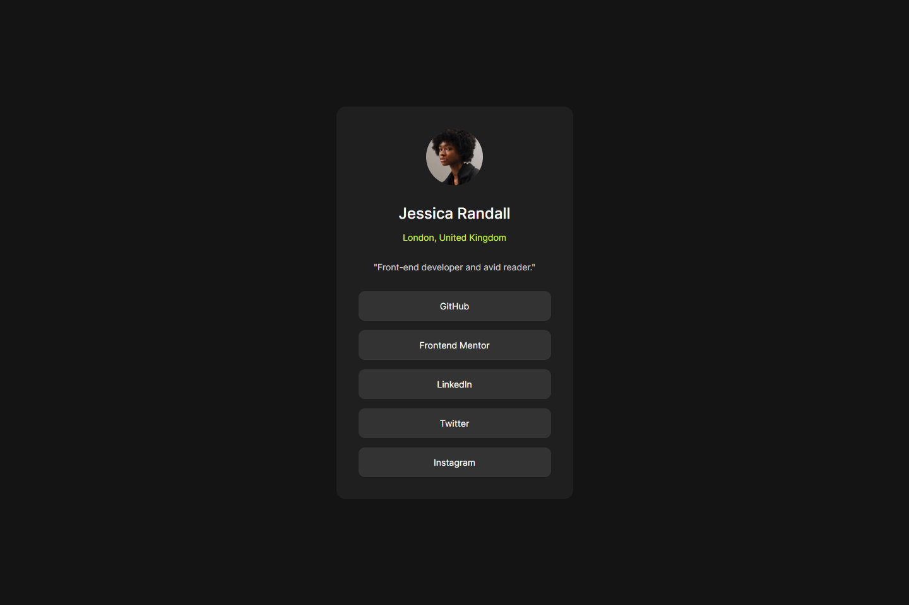
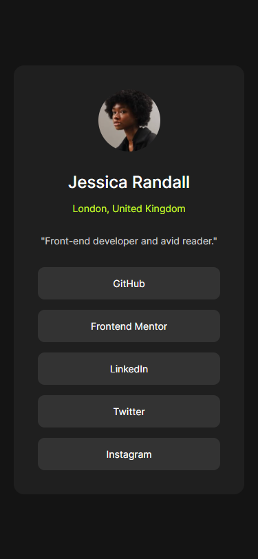

# Frontend Mentor - Social links profile solution

This is a solution to the [Social links profile challenge on Frontend Mentor](https://www.frontendmentor.io/challenges/social-links-profile-UG32l9m6dQ). Frontend Mentor challenges help you improve your coding skills by building realistic projects. 

## Table of contents

- [Overview](#overview)
  - [The challenge](#the-challenge)
  - [Screenshot](#screenshot)
  - [Links](#links)
- [My process](#my-process)
  - [Built with](#built-with)
  - [What I learned](#what-i-learned)
  - [Continued development](#continued-development)
  - [Useful resources](#useful-resources)
- [Author](#author)
- [Acknowledgments](#acknowledgments)

## Overview

### The challenge

Users should be able to:

- See hover and focus states for all interactive elements on the page

### Screenshot

<!-- 
 -->

### Links

- Solution URL: [Code on GitHub](https://github.com/ErwiniaDev/FrontendMentor_SocialLinksProfile.git)
- Live Site URL: [GitHub Page](https://erwiniadev.github.io/FrontendMentor_SocialLinksProfile/)

## My process

### Built with

- Semantic HTML5 markup
- CSS custom properties
- Flexbox

### What I learned

- Reuse the Modern CSS Reset
- Use the custom properties for colors and fonts
- Be careful with div (I used article... I don't know if it's a good practice)

### Continued development

It's not pixel perfect. I need to correct it.
And I don't use the good units I think (rem instead of pixels).

### Useful resources

- Modern CSS Reset by Andy Bell https://dev.to/hankchizljaw/a-modern-css-reset-6p3
- For the \<article\> choice : https://dev.to/zac_heisey/7-alternatives-to-the-div-tag-in-html-62i

## Author

Frontend Mentor - [@ErwiniaDev](https://www.frontendmentor.io/profile/ErwiniaDev)

## Acknowledgments

Thank you @teabag12 for your feedback.